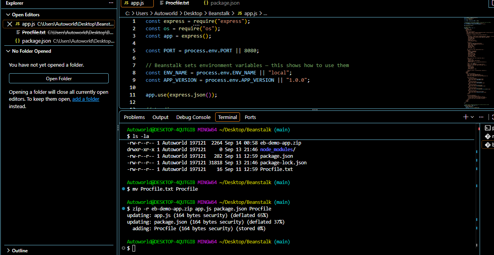
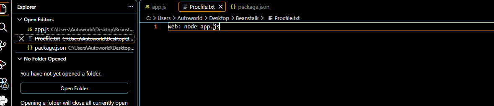
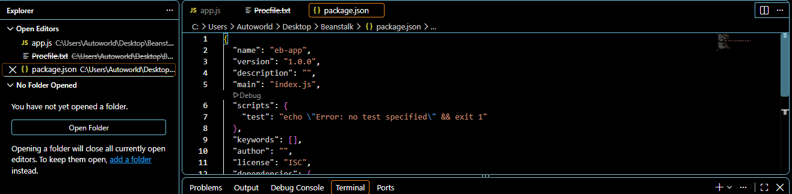
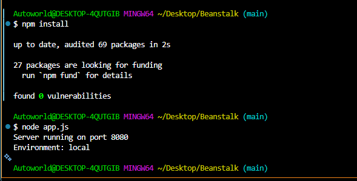
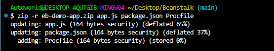
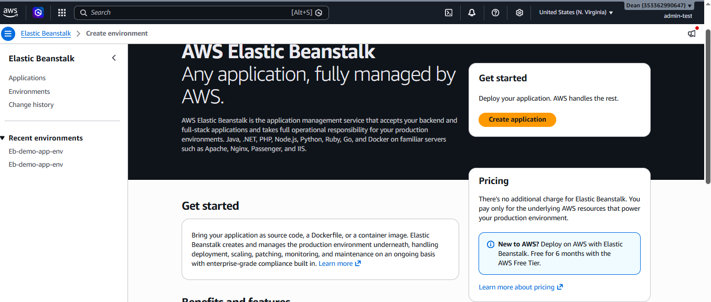
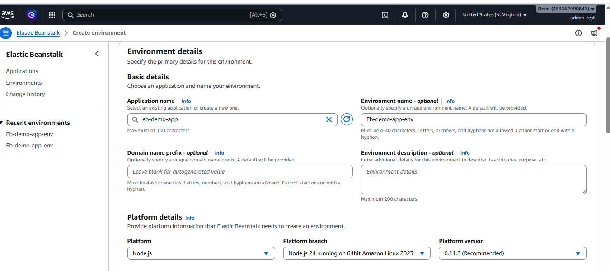
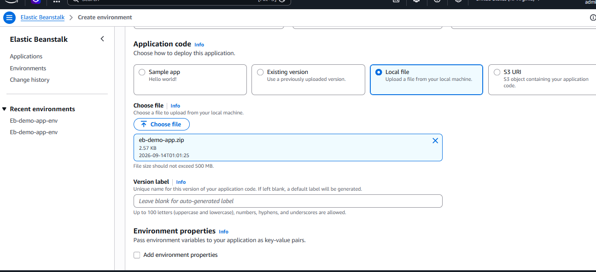
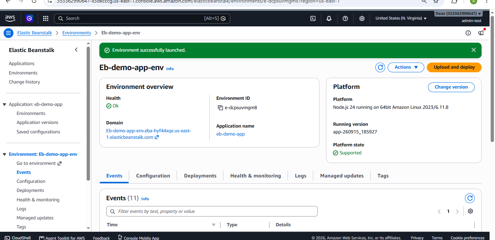
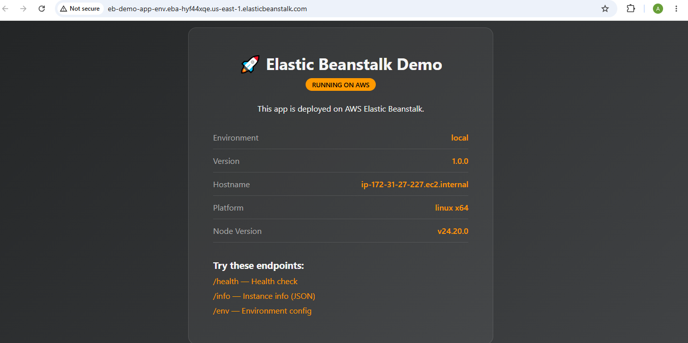

# Deploying a Node.js App with AWS Elastic Beanstalk

## Introduction

For this task, I deployed a simple Node.js application using AWS Elastic Beanstalk.

## Step 1: Create the Application Files

I created the main files needed for the Node.js application:

* `app.js`
* `package.json`
* `Procfile`

I then added the required code to each file.

The `app.js` file contained the application code, including the `/health` route used for the Elastic Beanstalk health check.

The `package.json` file contained the project information and dependencies.

The `Procfile` was used to tell Elastic Beanstalk how to start the application.

```text
web: node app.js
```



## Step 2: Install Dependencies

I installed the required Node.js packages for the application using npm.

```bash
npm install
```

This created the `node_modules` folder containing the installed packages.

## Step 3: Zip the Application

I packaged the main application files into a ZIP file using:

```bash
zip -r eb-demo-app.zip app.js package.json Procfile
```

The ZIP file contained:

* `app.js`
* `package.json`
* `Procfile`


## Step 4: Create an Elastic Beanstalk Environment

I opened **AWS Elastic Beanstalk** and created an application

named:

```text
eb-demo-app
```

I created the environment:

```text
Eb-demo-app-env
```

I selected **Node.js** as the platform and uploaded my `eb-demo-app.zip` file.

For the environment setup, I used the single-instance configuration required for the task.

## Step 5: Check the Deployment

After the configuration was applied, I checked the Elastic Beanstalk environment and its health status.

The application was deployed through Elastic Beanstalk and I used the environments domain name to access the application.

